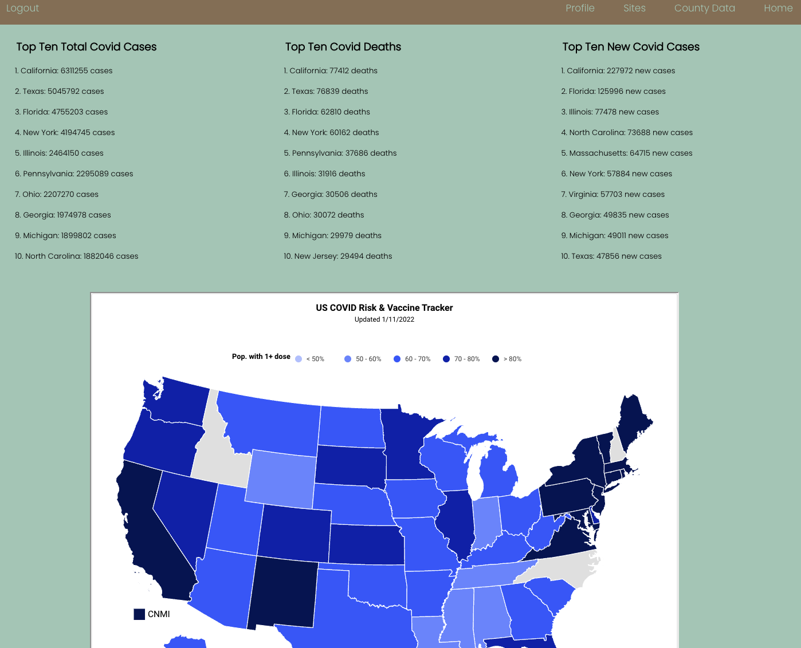
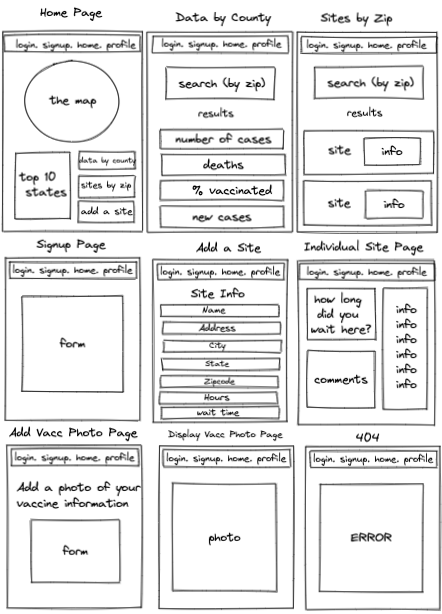
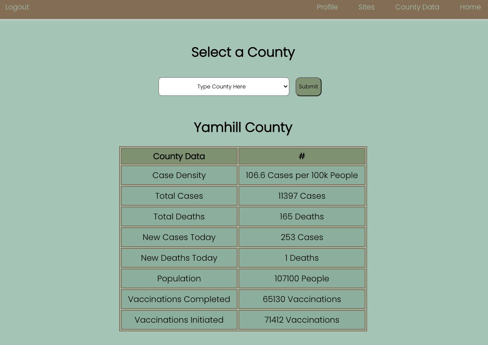
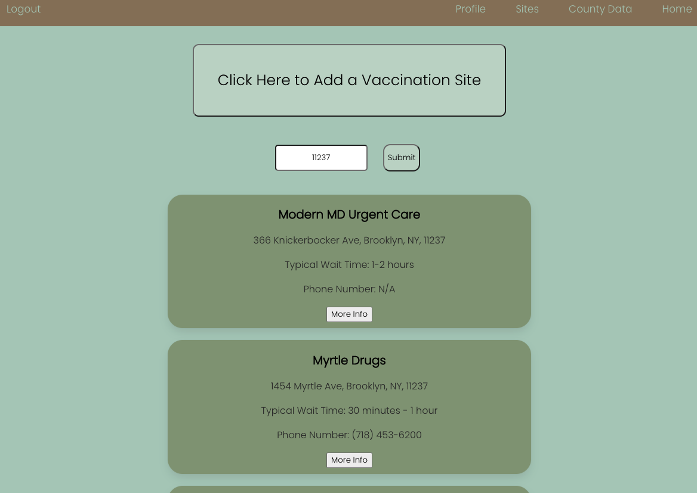
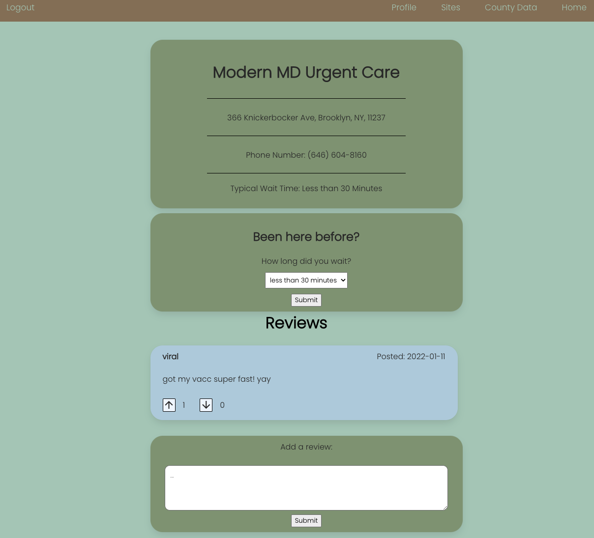

# `Viral`

Viral is a MERN stack application used for finding the latest COVID information by location,
display latest COVID hotspots, and provide users information on where they can get vaccines and booster shots.
Users will be able to ‘vouch’ for vaccination sites and leave reviews to let others know if they are reliable and how quickly they can get help.

### `Home Page`


## `Give it a Try`
* <a href="https://viral-covid.herokuapp.com/">Go to the live site here</a>
* Follow these Installation instructions
    * npm install
    * connect to the backend

## `User Stories`
- User inputs locations and information for booster shots and vaccines and can upvote existing post
- See updated infection rate information
- Search those locations based on zip code
- Upload vaccine photo
- list of top COVID infection rate cities

## `Wire Frame`
This is the original plan for how the site would be connected and a rough layout of its look.


## `ERD`
This ERD details the information stored in the database and the associations between them.


## `Technology of the Website`

### County Data

#### The Page:


#### The Code:
```
    displayCounties() {

        const display = this.state.data.map((c, idx) => {
            return (
                <CountyOptions
                    key={idx}
                    name={c}
                />
            )
        })

        return display;
    }

    handleChange = (event) => {
        this.setState({
            county: event.target.value
        })
    }

    handleSubmit = (e) => {
        e.preventDefault(); // at the beginning of a submit function
        const userData = {
            county: this.state.county
        };

        axios.post(`${REACT_APP_SERVER_URL}/actNow/county`, userData)
            .then(response => {
                console.log(response.data.countyInfo)
                this.setState({
                    countyInfo: {
                        name: response.data.countyInfo.county,
                        caseDensity: response.data.countyInfo.caseDensity,
                        cases: response.data.countyInfo.cases,
                        deaths: response.data.countyInfo.deaths,
                        newCases: response.data.countyInfo.newCases,
                        newDeaths: response.data.countyInfo.newDeaths,
                        population: response.data.countyInfo.population,
                        vaccinationsCompleted: response.data.countyInfo.vaccinationsCompleted,
                        vaccinationsInitiated: response.data.countyInfo.vaccinationsInitiated,
                    }
                });
```

#### The Explanation:
This page allows users to see data about a county from a list that is provided in a dropdown. The displayCounties function creates the list of counties in the dropdown menu from the data grabbed from the API. The handle change sets the county state to the county chosen by the user from the dropdown list. And the handleSubmit function sends the county chosen to the backend when the submit button is clicked. It then recieves the data about that county and displays it in the table on the page.

### Vaccination Site Search

#### The Page:


#### The Code:
```
    handleZipCode(e) {
        this.setState({
            zipCode: e.target.value,
        });
    }

    handleSubmit = (e) => {
        e.preventDefault();
        if(this.state.zipCode.length != 5 || isNaN(this.state.zipCode)){
            alert("Please enter a 5 digit number for the zip code");
        }
        else{

        axios.get(`${REACT_APP_SERVER_URL}/site/zip/${this.state.zipCode}`)
            .then((response) => {
                if (response.data.zipArr !== undefined) {
                    // console.log('DATA', response.data.zipArr == undefined);
                    this.setState({
                        data: response.data.zipArr,
                        secondaryData: response.data.closeByArr
                    })
                }
                else {
                    return alert("no sites available for this zipcode");
                }
                // console.log('WHAOAOHAOHOAH', this.state.data);
            })
            .catch(error => {
                console.log('error gettin zippy', error);
            })
        }
    };

    displaySiteSearch() {
        const display = this.state.data.map((s, idx) => {
            return <SiteResult key={idx} id={s._id} name={s.name} phoneNumber={s.phoneNumber} popularWaitTime={s.popularWaitTime} address={s.address} state={s.state} zipCode={s.zipCode} city={s.city} />
        });
        return display;
    }
```

#### The Explanation:
This page provides a search bar that allows users to search for all vaccination sites with a given zip code. The handleZipCode function sets zipCode to what the user types into the search bar. The handleSubmit function validates that the user inputed a 5 digit number and then sends that number to the backend. When it recieves that data is puts it into an array. The displaySiteSearch function displays all of the sites found with the given zipcode and close to the given zipcode. 

### Vaccination Site

#### The Page:


#### The Code:
```
    handleSubmitWaitTimes = (e) => {
        e.preventDefault();
        let commentValue = this.state.message;
       
        let newWaitTimes = {
            waitTimes: this.state.waitTimes, 
            siteId: this.props.id
        };

        axios.put(`${REACT_APP_SERVER_URL}/site/updateWaitTime`, newWaitTimes)
            .then(response => {
                console.log(response.data);
                // this.setState({
                //     waitTime: this.state.waitTime
                // })
           
                alert('Your wait time has been submitted. Thanks for your feedback!');
            })
            .catch(error => {
                console.log('===> ERROR GETTING DATA', error);
            });
        window.location.reload();
    };

    displayComments() {
        const display = this.state.commentData.map((c, idx) => {
            return (
                <Comment
                    id={c._id}
                    key={idx}
                    review={c.review}
                    createdDate={c.createdDate}
                    upVotes={c.upVotes}
                    downVotes={c.downVotes}
                    userName={c.userName}
                    user={this.props.user}
                    downVoteColor={c.downVoteColor}
                    upVoteColor={c.upVoteColor}
                />
            );
        });
        return display;
    }
```

#### The Explanation:
This page loads when the user chooses a vaccination site after searching for one or when the user creates a new vaccination site. It displays one particular site and any comments that have been made about that vaccination site.  The handleSubmitWaitTime function provides options for the user to choose from for how long they waited if they've been to the site and submits their input to the backend. It then reloads the page with the updated wait time taken into consideration.The display comments function creates all of the comment bubbles that suers have created for the particular site. 

## Major Hurdles
* One blocker we ran into was having the profile page display the correct photo when the user updated it. We solved the issue by reloading the page once the photo had been uploaded to Coudinary
*
